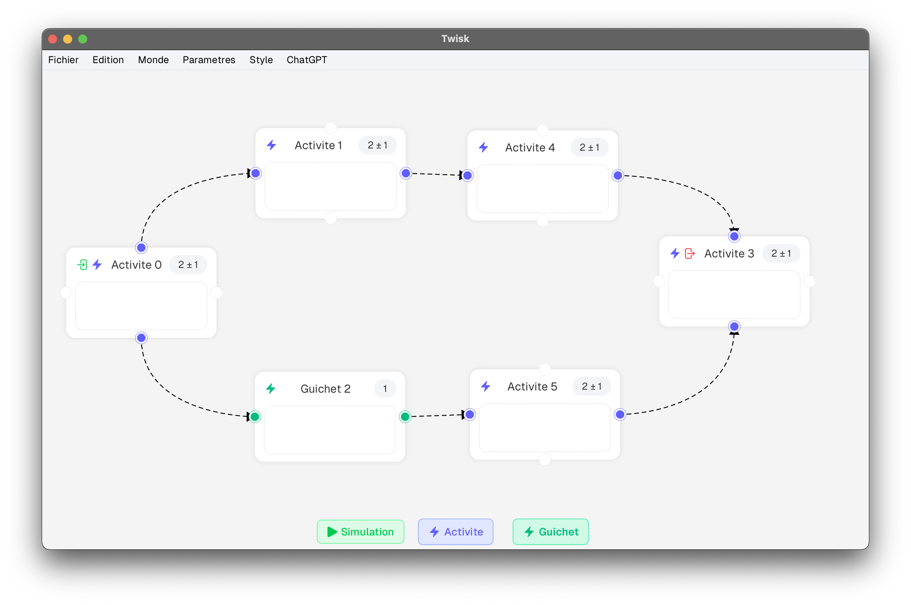
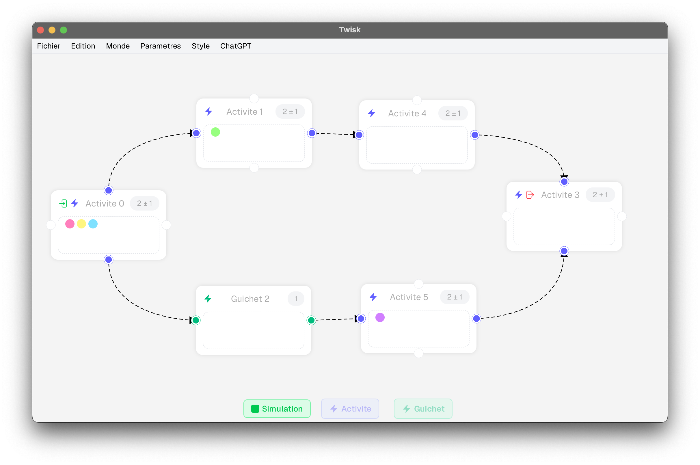
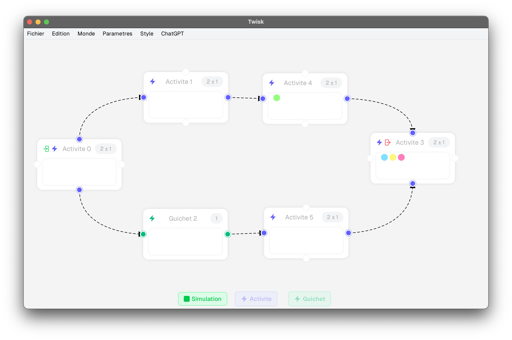

# Twisk

A JavaFX-based simulation framework for modeling and visualizing concurrent systems with activities, queues, and resource management.

<div align="center">
  
  
  
</div>

## Overview

Twisk is a graphical simulation tool designed to model and visualize complex concurrent systems. The application allows users to create custom "worlds" composed of different types of stages (activities, queues, restricted activities) and simulate the flow of multiple clients through these stages in real-time.

The project demonstrates advanced concepts in concurrent programming, graphical user interface design, and the integration of Java with native C code for high-performance simulation execution.

## What is Twisk?

Twisk enables users to build and simulate scenarios where multiple clients navigate through a series of interconnected stages. Each stage can represent:

- **Activities**: Regular stages where clients spend a variable amount of time
- **Guichets (Queues)**: Resource-constrained stages with limited capacity, forcing clients to wait
- **Restricted Activities**: Activities with a maximum capacity that clients can occupy simultaneously

The simulation runs in real-time, allowing users to observe how clients move through the system, queue at bottlenecks, and complete their journey. This makes Twisk particularly useful for understanding:

- Queue theory and resource management
- Concurrent process synchronization
- System bottleneck identification
- Workflow optimization

## Features

- **Visual World Builder**: Drag-and-drop interface to create custom simulation scenarios
- **Real-time Simulation**: Watch clients navigate through stages with live updates
- **Multiple Stage Types**: Support for activities, queues, and restricted activities
- **Customizable Parameters**: Configure timing, capacity, and resource constraints
- **Save/Load Functionality**: Persist simulation scenarios as JSON files
- **C-based Simulation Engine**: High-performance native simulation backend
- **JavaFX GUI**: Modern, responsive user interface

## Technical Challenges

Building Twisk presented several interesting technical challenges:

### 1. **Java-C Integration**
The simulation engine is written in C for performance, while the GUI is built with JavaFX. Bridging these two required:
- Dynamic library loading using JNI (Java Native Interface)
- Custom class loader implementation to reload simulation code without restarting the application
- Memory management across the Java-C boundary

### 2. **Concurrent Simulation**
Managing multiple clients moving through stages simultaneously required:
- Semaphore-based synchronization for resource-constrained stages
- Thread-safe data structures for tracking client positions
- Real-time updates to the GUI without blocking the simulation

### 3. **Graph-based World Model**
The world is represented as a directed graph where:
- Nodes are stages (activities, queues, etc.)
- Edges represent possible transitions
- The system validates graph integrity (no orphaned stages, proper entry/exit points)

### 4. **Code Generation**
The application dynamically generates C code from the Java world model:
- Converts the graph structure into C functions
- Generates preprocessor definitions for stage identifiers
- Compiles and links the C code at runtime

### 5. **MVC Architecture**
The project follows a strict Model-View-Controller pattern:
- **Model**: `monde` package (world representation)
- **View**: `vues` package (JavaFX components)
- **Controller**: `mondeIG` package (interactive world management)

## Libraries and Technologies

- **JavaFX 17**: GUI framework for the visual interface
  - `javafx.controls`: UI components
  - `javafx.fxml`: Declarative UI layouts
- **Java 17**: Core programming language
- **C (POSIX)**: Native simulation engine
  - POSIX threads for concurrency
  - Semaphores for synchronization
  - Shared memory for client tracking
- **JNI (Java Native Interface)**: Java-C interoperability
- **JSON**: Serialization format for saving/loading worlds
- **Make**: Build system for C components

## Project Structure

```
twisk/
├── src/
│   ├── main/
│   │   ├── java/twisk/
│   │   │   ├── monde/          # World model (stages, activities, queues)
│   │   │   ├── mondeIG/        # Interactive GUI world management
│   │   │   ├── simulation/     # Simulation engine and client management
│   │   │   ├── vues/           # JavaFX views and UI components
│   │   │   ├── outils/         # Utilities (ID generation, constants)
│   │   │   └── exceptions/     # Custom exceptions
│   │   ├── c/                  # C simulation code
│   │   └── ressources/
│   │       ├── codeC/          # C headers and definitions
│   │       └── css/            # Stylesheets
│   └── test/                   # Unit tests
└── out/                        # Compiled output
```

## How to Run

### Prerequisites
- Java 17 or higher
- JavaFX SDK 17.0.11

### Running from JAR

Download the latest release from the [GitHub Releases](https://github.com/ayoubdlf/twisk/releases) page, then run:

```bash
java --module-path /path/to/javafx-sdk-17.0.11/lib \
     --add-modules javafx.controls,javafx.fxml \
     -jar Twisk.jar
```

Replace `/path/to/javafx-sdk-17.0.11/lib` with the actual path to your JavaFX SDK library directory.

### Building from Source

1. Clone the repository:
```bash
git clone https://github.com/ayoubdlf/twisk.git
cd twisk
```

2. Compile the Java sources (ensure JavaFX is in your classpath)

3. Build the C components:
```bash
cd src/main/c
make
```

4. Run the application with the JavaFX module path as shown above

## Usage

1. **Create a World**: Use the GUI to add activities, queues, and restricted activities
2. **Connect Stages**: Draw connections between stages to define the flow
3. **Set Entry/Exit Points**: Designate which stages are entry and exit points
4. **Configure Parameters**: Set timing, capacity, and resource constraints for each stage
5. **Run Simulation**: Start the simulation and watch clients navigate through your world
6. **Save/Load**: Save your world as JSON for later use

## Example Scenarios

The project includes several pre-built scenarios:

- **Zoo World**: Clients visit a zoo and queue for a toboggan slide
- **Sequential Flow**: Eight activities in sequence
- **Parallel Paths**: Clients split into parallel paths with different queues
